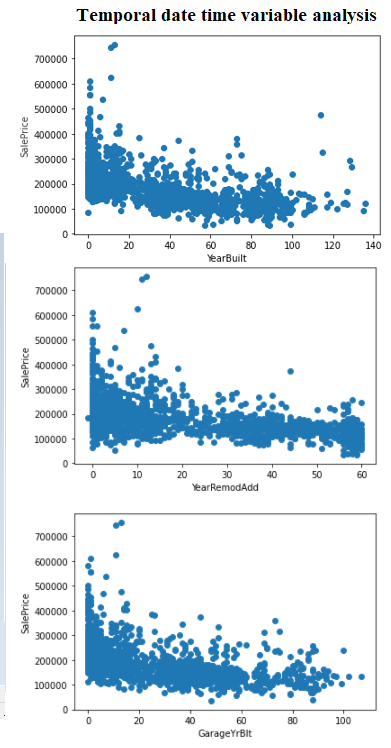

# House Prices Prediction using Regression Techniques
Building a regression model from scratch using Tensorflow & Keras. 

**About the data:** 
The training dataset available at https://www.kaggle.com/c/house-prices-advanced-regression-techniques/data

## Lifecycle of this Project

1.Data Analysis
2.Feature Engineering
3.Feature Selecion
4.Model Building

# Temporal Date Time Variable Analysis

# Continuous Variable Distribution

